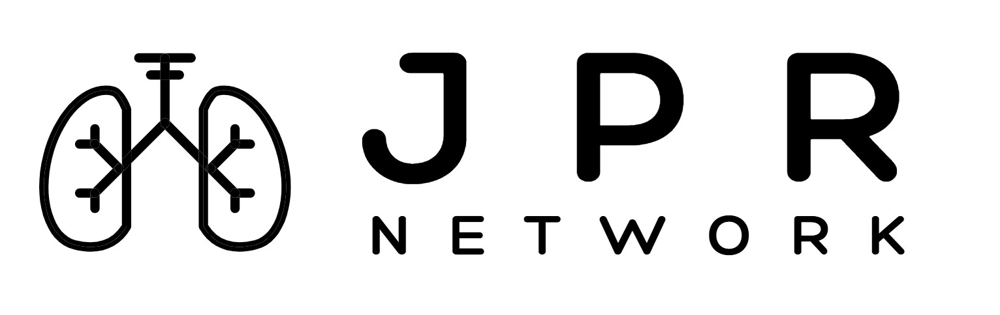

# 日本呼吸器疾患研究ネットワーク

## Japan Pulmonary Research Network (JPRN)

## 目次

-   [About Us](#about-us)
-   [お知らせ](#お知らせ)
-   [運営](#運営)
-   [実施中の研究](#実施中の研究)
    -   [臨床研究](#臨床研究)
    -   [基礎研究](#基礎研究)
-   [業績](#業績)
-   [Funding](#funding)
-   [参加施設/共同研究施設](#参加施設共同研究施設)
    -   [参加施設](#参加施設)
    -   [共同研究施設](#共同研究施設)
-   [利用規約](#利用規約)
-   [著作権](#著作権)

------------------------------------------------------------------------

## About Us

呼吸器とは呼吸に関わる臓器の総称で、鼻・口から始まり気道や肺などから構成されています。\
[WHOの報告](https://www.who.int/news-room/fact-sheets/detail/the-top-10-causes-of-death)では2021年の世界的死因において呼吸器疾患及び呼吸器感染症はTop 10 のうちの4つを占めています（COVID-19、COPD、下気道感染、呼吸器悪性腫瘍、結核）。これは、呼吸器疾患の研究によってより充実した生活を送ることが可能となる患者が世界的にも非常に多いことを意味します。\
遺伝学、免疫学、生理学、薬理学、臨床疫学、臨床試験、人工知能、データサイエンスなどの多様な分野の専門家が協力して、呼吸器疾患の研究を進めることが重要です。\
本研究グループは呼吸器疾患のベンチからベッドサイドまでの発展的研究を目指し、施設や国の垣根を越えて若手呼吸器内科医及び呼吸器研究者が協働・協議するためのプラットフォームを提供するために2024年に結成されました。

-   **目的**：呼吸器疾患研究の発展を促し、呼吸器疾患患者の健康寿命・QoL改善を目指す
-   **活動**：２週間に1回のリサーチミーティング、競争的研究費獲得、研究計画立案・実行・支援
-   **特徴**：Github を利用しオープンソースでアップデート可能な研究プラットフォームを提供

**連絡先**

-   基礎・橋渡し・臨床研究のご相談とオンラインリサーチミーティングの見学希望の方は[syamamoto4\@wisc.edu](mailto:syamamoto4@wisc.edu){.email}もしくはイシューの発行をお願いします\
-   製薬会社・企業の方からのお問い合わせは[syamamoto4\@wisc.edu](mailto:syamamoto4@wisc.edu){.email}までお願いします

------------------------------------------------------------------------

## お知らせ

-   **2025年3月** Github リポジトリを公開しました

------------------------------------------------------------------------

## 運営

-   **山本章太**（Senior Director）
-   **今井亮介**（Director：疫学・臨床研究担当）
-   **新津敬之**（Director：基礎・橋渡し研究担当）

------------------------------------------------------------------------

## 実施中の研究

### 臨床研究

-   **ARDSに対するステロイドのDose-finding メタ解析**（PROSPERO: CRD42024552991）
-   **ARDS 患者における筋炎関連/特異的抗体の病態解明**（Mass General Brigham Institutional Review Board: Protocol #2022P001829）
-   **ARDS 発症ハイリスク患者におけるARDS global definition の予後予測能**（大阪大学 倫理審査委員会承認済み）
-   **呼吸不全患者に対する至適酸素化目標値の探索：RCTのベイズ解析**（PROSPERO: CRD42024604968）
-   **IPF 患者における抗線維化薬の治療反応異質性評価**（大阪大学 倫理審査委員会承認済み）
-   **NCBEに対する抗炎症治療のNMA**（PROSPERO: CRD42024605694）\
-   **生活習慣と生理学的要因が肺機能に与える影響の縦断的評価**（聖路加国際大学 倫理審査委員会: 24-R137）\
    （注：ARDS, Acute respiratory distress syndrome; IPF, Idiopathic pulmonary fibrosis; NCBE, Non-cystic fibrosis bronchiectasis; NMA, Network meta-analysis）

### 基礎研究

-   **肺間質における細胞外マトリックスの質的・量的変化**（University of Wisconsin IACUC: M006349）
-   **肺線維症モデルマウスにおけるプロテオミクス解析**（University of Wisconsin IACUC: M006349）
-   **線維性及び嚢胞性肺疾患における空間トランスクリプトーム解析**（大阪大学 倫理審査委員会承認済み）
-   **重症呼吸不全患者における末梢血を用いたマルチオミクス解析**（Mass General Brigham Institutional Review Board: Protocol #2022P001829）

------------------------------------------------------------------------

## 業績

### Peer reviewed publication（5年以内、著者は6名まで記載）

1.  **Yamamoto S.**, Horita N., **Imai R.**, **Niitsu T.**\
    Surgical and Bronchoscopic Lung Volume Reduction for Severe Emphysema: A Systematic Review and Network Meta-analysis.\
    Lung. 2025;203(1):22.\
    doi: [10.1007/s00408-024-00777-0](https://doi.org/10.1007/s00408-024-00777-0)
    
1.  **Imai R.**, Tomishima Y., Nakamura T., Yamada D., Ro S., So C., et al.\ 
    Prognosis of Equivocal Interstitial Lung Abnormalities in a Health Check-up Population. \
    Ann Am Thorac Soc. 2025;22(3):387-394.\
    doi: [10.1513/AnnalsATS.202408-867OC](https://doi.org/10.1513/AnnalsATS.202408-867OC)
    

2.  Hashimoto K., Abe Y., Fukushima K., **Niitsu T.**, Komukai S., Miyamoto S., et al.\
    Epidemiology of bronchiectasis at a single center in Japan: a retrospective cohort study.\
    BMC Pulm Med. 2024;24(1):531.\
    doi: [10.1186/s12890-024-03337-7](https://doi.org/10.1186/s12890-024-03337-7)

3.  Horita N., **Yamamoto S.**, Mizuki Y., Kawagoe T., Mihara T., Yamashiro T.\
    Minimal clinically important difference (MCID) of effect sizes other than mean difference.\
    J Clin Q. 2024;1(3):116-127.\
    doi: [10.69854/jcq.2024.0016](https://doi.org/10.69854/jcq.2024.0016)

4.  **Yamamoto S.**, Horita N., Hara J., Sasamoto M., Kanemitsu Y., Hara Y., et al.\
    Benefit-risk profile of P2X3 receptor antagonists for treatment of chronic cough: Dose-response model-based network meta-analysis.\
    Chest. 2024;166(5):1124-1140.\
    doi: [10.1016/j.chest.2024.05.015](https://doi.org/10.1016/j.chest.2024.05.015)

5.  Fukushima K., Matsumoto Y., Abe Y., Hashimoto K., Motooka D., Kitada S., et al.\
    Variability of macrolide-resistant profile in Mycobacterium avium complex pulmonary disease.\
    Antimicrob Agents Chemother.2024;68(11):e0121324.\
    doi: [10.1128/aac.01213-24](https://doi.org/10.1128/aac.01213-24)

6.  **Niitsu T.**, Fukushima K., Komukai S., Takata S., Abe Y., Nii T., et al.\
    Real-world impact of antifibrotics on prognosis in patients with progressive fibrosing interstitial lung disease.\
    RMD Open. 2023;9(1):e002667.\
    doi: [10.1136/rmdopen-2022-002667](https://doi.org/10.1136/rmdopen-2022-002667)

7.  Fukushima K., Matsumoto Y., Matsuki T., Saito H., Motooka D., Komukai S., et al.\
    MGIT-seq for the Identification of Nontuberculous Mycobacteria and Drug Resistance: a Prospective Study.\
    J Clin Microbiol. 2023;61(4):e0162622.\
    doi: [10.1128/jcm.01626-22](https://doi.org/10.1128/jcm.01626-22)

8.  Nagano N., Suzuki M., **Yamamoto S.**, Kobayashi K., Iikura M., Izumi S., et al.\
    Short- and long-term efficacy of bronchial artery embolization using a gelatin sponge for the treatment of cryptogenic hemoptysis.\
    Glob Health Med. 2022;4(6):315-321.\
    doi: [10.35772/ghm.2022.01057](https://doi.org/10.35772/ghm.2022.01057)

9.  Matsumoto T., Endo K., **Yamamoto S.**, Suda S., Tomita K., Kamei S., et al.\
    Dose length product and outcome of CT fluoroscopy-guided interventions using a new 320-detector row CT scanner with deep-learning reconstruction and new bow-tie filter.\
    Br J Radiol. 2022;20211159.\
    doi: [10.1259/bjr.20211159](https://doi.org/10.1259/bjr.20211159)

10. Hashimoto H., **Yamamoto S.**, Nakagawa H., Suido Y., Sato S., Tabata E., et al.\
    Predictive value of computed tomography for short-term mortality in patients with acute respiratory distress syndrome: a systematic review.\
    Sci Rep. 2022;12(1):9579.\
    doi: [10.1038/s41598-022-13972-x](https://doi.org/10.1038/s41598-022-13972-x)

11. **Yamamoto S.**, Sakamaki F., Takahashi G., Yuji R., Matsumoto T., Hasebe T.\
    Novel pulmonary perfusion imaging using chest digital dynamic radiography for pulmonary artery sarcoma.\
    Respirol Case Rep. 2021;9(4):e00737.\
    doi: [10.1002/rcr2.737](https://doi.org/10.1002/rcr2.737)

12. Kawasaki T., Takeda Y., Edahiro R., Shirai Y., Nogami-Itoh M., Matsuki T., et al.\
    Next-generation proteomics of serum extracellular vesicles combined with single-cell RNA sequencing identifies MACROH2A1 associated with refractory COVID-19.\
    Inflamm Regen. 2022;42(1):53.\
    doi: [10.1186/s41232-022-00243-5](https://doi.org/10.1186/s41232-022-00243-5)

13. Namkoong H., Edahiro R., Takano T., Nishihara H., Shirai Y., Sonehara K., et al.\
    DOCK2 is involved in the host genetics and biology of severe COVID-19.\
    Nature. 2022;609(7928):754-760.\
    doi: [10.1038/s41586-022-05163-5](https://doi.org/10.1038/s41586-022-05163-5)

14. Wang Q.S., Edahiro R., Namkoong H., Hasegawa T., Shirai Y., Sonehara, et al.\
    The whole blood transcriptional regulation landscape in 465 COVID-19 infected samples from Japan COVID-19 Task Force.\
    Nat Commun. 2022;13(1):4830.\
    doi: [10.1038/s41467-022-32276-2](https://doi.org/10.1038/s41467-022-32276-2)

15. Noda Y., Shiroyama T., Masuhiro K., Amiya S., Enomoto T., Adachi Y., et al.\
    Quantitative evaluation of emphysema for predicting immunotherapy response in patients with advanced non-small-cell lung cancer.\
    Sci Rep. 2022;12(1):8881.\
    doi: [10.1038/s41598-022-13131-2](https://doi.org/10.1038/s41598-022-13131-2)

16. Abe Y., Fukushima K., Matsumoto Y., **Niitsu T.**, Nabeshima H., Nagahama Y., et al.\
    Mycobacterium senriense sp. nov., a slowly growing, non-scotochromogenic species, isolated from sputum of an elderly man.\
    Int J Syst Evol Microbiol. 2022;72(5).\
    doi: [10.1099/ijsem.0.005378](https://doi.org/10.1099/ijsem.0.005378)

17. Maeda Y., Motooka D., Kawasaki T., Oki H., Noda Y., Adachi Y., **Niitsu T.**, et al.\
    Longitudinal alterations of the gut mycobiota and microbiota on COVID-19 severity.\
    BMC Infect Dis. 2022;22(1):572.\
    doi: [10.1186/s12879-022-07358-7](https://doi.org/10.1186/s12879-022-07358-7)

18. Enomoto T., Shiroyama T., Hirata H., Amiya S., Adachi Y., **Niitsu T.**, et al.\
    COVID-19 in a human T-cell lymphotropic virus type-1 carrier.\
    Clin Case Rep. 2022;10(2):e05463.\
    doi: [10.1002/ccr3.5463](https://doi.org/10.1002/ccr3.5463)

19. **Niitsu T.**, Hayashi T., Uchida J., Yanase T., Tanaka S., Kuroyama M., et al.\
    Drug-Induced Kidney Injury Caused by Osimertinib: Report of a Rare Case.Nephron.\
    2022;146(1):58-63.\
    doi: [10.1159/000518774](https://doi.org/10.1159/000518774)

20. **Yamamoto S.**, Matsumoto T., Suda S., Tomita K., Kamei S., Hashida K., et al.\
    First experience of efficacy and radiation exposure in 320-detector row CT fluoroscopy-guided interventions.\
    Br J Radiol. 2021;94(1120):20200754.\
    doi: [10.1259/bjr.20200754](https://doi.org/10.1259/bjr.20200754)

21. Saito G., Oya Y., Taniguchi Y., Kawachi H., Fujimoto D., Matsumoto H., et al.\
    Real-world survey of pneumonitis and its impact on durvalumab consolidation therapy in patients with non-small cell lung cancer who received chemoradiotherapy after durvalumab approval (HOPE-005/CRIMSON).\
    Lung Cancer. 2021;161:86-93.\
    doi: [10.1016/j.lungcan.2021.08.019](https://doi.org/10.1016/j.lungcan.2021.08.019)

22. Amiya S., Hirata H., Shiroyama T., Adachi Y., **Niitsu T.**, et al.\
    Fatal cytomegalovirus pneumonia in a critically ill patient with COVID-19.\
    Respirol Case Rep\* 2021;9(7):e00801.\
    doi: [10.1002/rcr2.801](https://doi.org/10.1002/rcr2.801)

23. Noda Y., Shiroyama T., Amiya S., Adachi Y., Enomoto T., Hara R., et al.\
    COVID-19 in a patient with sporadic lymphangioleiomyomatosis awaiting lung transplantation.\
    Respir Med Case Rep. 2021;34:101505.\
    doi: [10.1016/j.rmcr.2021.101505](https://doi.org/10.1016/j.rmcr.2021.101505)

24. **Niitsu T.**, Kuge T., Fukushima K., Matsumoto Y., Abe Y. Okamoto M., et al.\
    Pleural Effusion Caused by Mycolicibacterium mageritense in an Immunocompetent Host: A Case Report.\
    Front Med (Lausanne). 2021;8:797171.\
    doi: [10.3389/fmed.2021.797171](https://doi.org/10.3389/fmed.2021.797171)

25. **Niitsu T.**, Shiroyama T., Hirata H., Noda Y., Adachi Y., Enomoto T., et al.\
    Cytomegalovirus infection in critically ill patients with COVID-19.\
    J Infect. 2021;83(4):496-522.\
    doi: [10.1016/j.jinf.2021.07.004](https://doi.org/10.1016/j.jinf.2021.07.004)

26. Adachi Y., Shiroyama T., Yamaguchi Y., Murakami T., Hirata H., Amiya S., et al.\
    Predicting recurrence of respiratory failure in critically ill patients with COVID-19: A preliminary study.\
    J Infect. 2021;82(5):e33-e35.\
    doi: [10.1016/j.jinf.2021.01.016](https://doi.org/10.1016/j.jinf.2021.01.016)

27. Abe Y., Suga Y., Fukushima K., Ohata H., **Niitsu T.**, Nabeshima H., et al.\
    Advances and Challenges of Antibody Therapeutics for Severe Bronchial Asthma.\
    Int J Mol Sci. 2021;23(1):83.\
    doi: [10.3390/ijms23010083](https://doi.org/10.3390/ijms23010083)

28. **Yamamoto S.**, Kamei S., Tomita K., Fujita C., Endo K., Hiraiwa S., et al.\
    CT-guided bone biopsy using electron density maps from dual-energy CT.\
    Radiol Case Rep. 2021;16(9):2343-2346.\
    doi: [10.1016/j.radcr.2021.06.009](https://doi.org/10.1016/j.radcr.2021.06.009)

29. Takeuchi HM., Morimoto K., Atsumi J., **Yamamoto S.**, Nakagawa T., Yamada S., et al.\
    Preoperative Endovascular Coil Embolisation for Chronic Pulmonary Aspergillosis.\
    Int J Tuberc Lung Dis. 2021;25(9):725-731.\
    doi: [10.5588/ijtld.21.0028](https://doi.org/10.5588/ijtld.21.0028)

30. Omachi N., Ishikawa H., Hara M., Nishihara T., Yamaguchi Y., Yamamoto Y., et al.\
    The impact of bronchial artery embolisation on the quality of life of patients with haemoptysis: a prospective observational study.\
    Eur Radiol. 2021;31(7):5351-5360.\
    doi: [10.1007/s00330-020-07533-x](https://doi.org/10.1007/s00330-020-07533-x)

31. Konno-Yamamoto A., Narumoto O., **Yamamoto S.**, Yamaguchi M., Motoyoshi M., Inoue Y., et al.\
    Diaphragmatic hernia during treatment of lung cancer harboring an EGFR mutation.\
    Oxford Med Case Rep. 2021;2021(7).\
    doi: [10.1093/omcr/omab054](https://doi.org/10.1093/omcr/omab054)

32. Hashimoto H., **Yamamoto S.**, Nakagawa H., Suido Y., Sato S., Tabata E., et al.\
    Clinical Utility of Surgical Lung Biopsy for Patients with Acute Respiratory Distress Syndrome: A Systematic Review and Meta-Analysis.\
    Respiration. 2021;101(4):422-432.\
    doi: [10.1159/000519675](https://doi.org/10.1159/000519675)

33. **Yamamoto S.**, Kamei S., Kondo Y., Hiraiwa S., Hasebe T., Sakamaki F.\
    Bronchial artery embolization for haemothorax and haemoptysis caused by primary lung cancer.\
    Respirol Case Rep. 2020;8(2):e00529.\
    doi: [10.1002/rcr2.529](https://doi.org/10.1002/rcr2.529)

34. **Yamamoto S.**, Hasebe T., Tomita K., Kamei S., Matsumoto T., Imai Y., et al.\
    Pulmonary perfusion by chest digital dynamic radiography: Comparison between breath-holding and deep-breathing acquisition.\
    J Appl Clin Med Phys. 2020.\
    doi: [10.1002/acm2.13071](https://doi.org/10.1002/acm2.13071)

35. Tomita K., Matsumoto T., Kamei S., **Yamamoto S.**, Suda S., Zakoji H., et al.\
    Transcatheter arterial embolization for unruptured renal angiomyolipoma using a 1.8-Fr tip microballoon catheter with a mixture of ethanol and Lipiodol.\
    CVIR Endovasc. 2020;3(1):3.\
    doi: [10.1186/s42155-019-0095-8](https://doi.org/10.1186/s42155-019-0095-8)

36. Takeuchi H., Matsumoto T., Morimoto K., Osawa T., Tanaka Y., Yoshimori K., et al.\
    Detection of Shunting Into Pulmonary Artery on Multidetector Row Computed Tomography Arteriography Before Bronchial Arterial Embolization: A Preliminary Study.\
    J Comput Assist Tomogr. 2020.\
    doi: [10.1097/rct.0000000000001099](https://doi.org/10.1097/rct.0000000000001099)

37. Takeda K., Kawashima M., Masuda K., Kimura Y., **Yamamoto S.**, Enomoto Y., et al.\
    Long-Term Outcomes of Bronchial Artery Embolization for Patients with Non-Mycobacterial Non-Fungal Infection Bronchiectasis.\
    Respiration. 2020;1-9.\
    doi: [10.1159/000511132](https://doi.org/10.1159/000511132)

38. **Niitsu T.**, Shiroyama T., Miyake K., Noda Y., Kido K., Hara R., et al.\
    Combined small cell lung carcinoma harboring ALK rearrangement: A case report and literature review.\
    Thorac Cancer. 2020;11(12):3625-3630.\
    doi: [10.1111/1759-7714.13716](https://doi.org/10.1111/1759-7714.13716)

39. Konno-Yamamoto A., **Yamamoto S.**, Suzuki J., Fukami T., Kitani M., Matsui H.\
    Migrated coil expectorated 12 years after embolization of pulmonary arteriovenous malformation, due probably to abscess formation around the coil.\
    Respir Med Case Rep. 2020;31:101245.\
    doi: [10.1016/j.rmcr.2020.101245](https://doi.org/10.1016/j.rmcr.2020.101245)

### Peer reviewed publication（5年以前、著者は6名まで記載）

1.  **Yamamoto S.**, Iikura M., Kakuwa T., Tsujimoto Y., Matsubayashi S., Nagano N., et al.\
    Can the Number of Radiofrequency Activations Predict Serious Adverse Events after Bronchial Thermoplasty? A Retrospective Case-Control Study.\
    Pulm Ther. 2019;5(2):221-233.\
    doi: [10.1007/s41030-019-00103-7](https://doi.org/10.1007/s41030-019-00103-7)

### Review article/Editorial

1.  **Yamamoto S.**, Sakamaki F.\
    Potential of dynamic chest radiography for preoperative evaluation of pleural adhesions.\
    J Thorac Dis. 2023;15(10):5278-5281.\
    doi: [10.21037/jtd-23-1192](https://doi.org/10.21037/jtd-23-1192)

### Letter/Correspondence

1.  **Yamamoto S.**, **Imai R.**, **Niitsu T.**\
    CRP-Guided Treatment in Pneumonia: Charting a Personalized Approach.\
    Lancet Respir Med. 2025 (in press).\
    doi: in press

2.  **Yamamoto S.**, Ishikawa H., Takeda K., Kawashima M.\
    Sputum colour matters: haemoptysis in a bronchiectasis registry.\
    Eur Respir J. 2024;64(2): 2400745.\
    doi: [10.1183/13993003.00745-2024](https://doi.org/10.1183/13993003.00745-2024)

3.  **Yamamoto S.**, Ichita C.\
    Potential of Muscle Mass Evaluation for Prognostic Prediction of COVID-19.\
    Chest. 2024;165(3):e86-e87.\
    doi: [10.1016/j.chest.2023.09.036](https://doi.org/10.1016/j.chest.2023.09.036)

4.  Nabeshima H., **Niitsu T.**, Fukushima K., Kida H.\
    Invariant natural killer T cells and iron metabolism orchestrate skin development and homeostasis.\
    Cell Mol Immunol. 2023;20(10):1095-1097.\
    doi: [10.1038/s41423-023-01016-x](https://doi.org/10.1038/s41423-023-01016-x)

------------------------------------------------------------------------

## Funding

-   **日本学術振興会 科学研究費助成事業（科研費） 若手研究**（2019−2022：課題番号19K17179）
-   **日本学術振興会 科学研究費助成事業（科研費） 基盤C研究**（2021−2023：課題番号21K08910）
-   **日本学術振興会 海外特別研究員**（2023−2025）
-   **国立研究開発法人 科学技術振興機構 ACT-X**（2025−2027: Grant Number JPMJAX242F)
-   **公益財団法人 上原記念生命科学財団 海外留学助成金Ⅰ**（2025−2026）
-   **公益財団法人 大阪難病研究財団　医学研究助成**（2023−2024: Grant Number 29-1-32)
-   **公益財団法人 大阪難病研究財団　医学研究助成**（2024−2025: Grant Number 30-2-37)
-   **The Office of the Assistant Secretary of Defense for Health Affairs, Peer Reviewed Medical Research Program**（2024−2028：Award No. HT9425-24-1-0543）
-   **Wisconsin Partnership Program, Collaborative Health Science Program grant**（2024−2028：Grant ID 6116）

------------------------------------------------------------------------

## 参加施設/共同研究施設

### 参加施設

-   University of Wisconsin-Madison APCC
-   聖路加国際病院 呼吸器内科
-   Massachusetts General Hospital 呼吸器内科
-   大阪大学 呼吸器内科
-   独立行政法人国立病院機構 大阪刀根山医療センター

### 共同研究施設

-   横浜市立大学
-   長崎大学
-   名古屋市立大学
-   金沢大学
-   福島県立医科大学
-   国立国際医療研究センター
-   国立病院機構東京病院
-   神奈川県立循環器呼吸器病センター
-   国立病院機構大阪刀根山医療センター
-   公益財団法人結核予防会 複十字病院
-   Harvard Medical School
-   University of North Carolina-Chapel Hill
-   Mayo Clinic
-   University of Washington
-   University of Bristol

------------------------------------------------------------------------

## 利用規約

### 注意事項

-   お互いに敬意を持ったコミュニケーションをお願いします。
-   建設的な議論を心がけてください。
-   わかりやすく簡潔な表現をお願いします。
-   情報を共有するときは、信頼性のあるデータや引用元に基づいていることを示してください。
-   議論をするときは適切なイシューやプルリクエストで議論してください。
-   注意事項に反して健全な議論が行われていないと判断した場合、一時的に当該スレッドのインタラクションを制限することがあります。

### 禁止事項

-   個人攻撃や誹謗中傷
-   差別的な発言
-   ハラスメント
-   スパム・広告の投稿
-   プライバシーの侵害
-   著作権の侵害
-   法令違反
-   その他公共の科学的議論の場にふさわしくない行為
-   上記に該当する行為が見受けられた場合、運営委員が削除することがあります。

------------------------------------------------------------------------

## 著作権

本リポジトリは MIT License の下で公開されています。すべての貢献は、同一の条件の下でライセンスされるものとします。\
詳細は[こちら](https://mit-license.org)をご覧ください。

著作権者（山本章太）のクレジットを表示すること、およびライセンスへのリンクを提供することを条件に、営利・非営利での複製・再配布・翻案・改変が可能です。\
また、本リポジトリの内容を利用する際は、著作権者への連絡をお願いいたします。

貢献者の著作権者表記につきましては、当リポジトリへのコミットログ等をもって代えさせていただきます。
